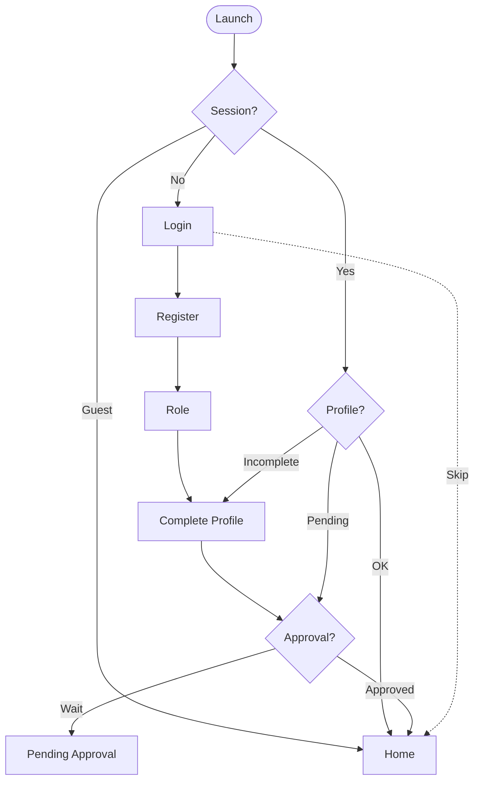
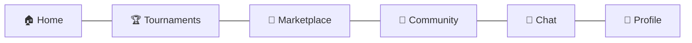
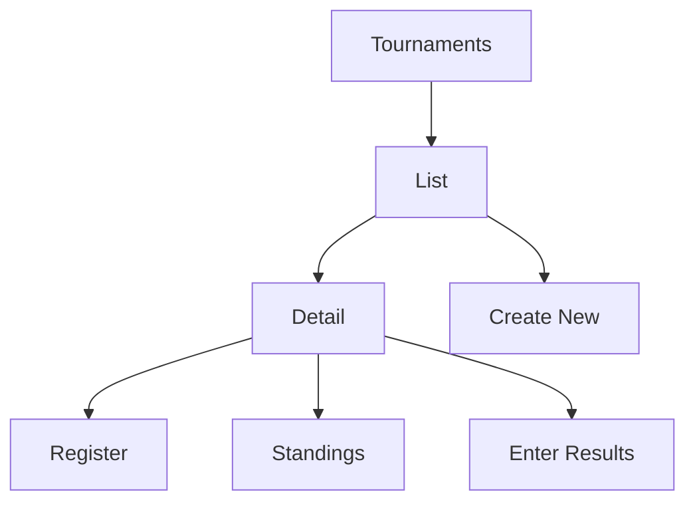
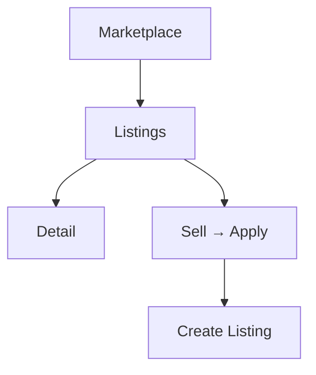
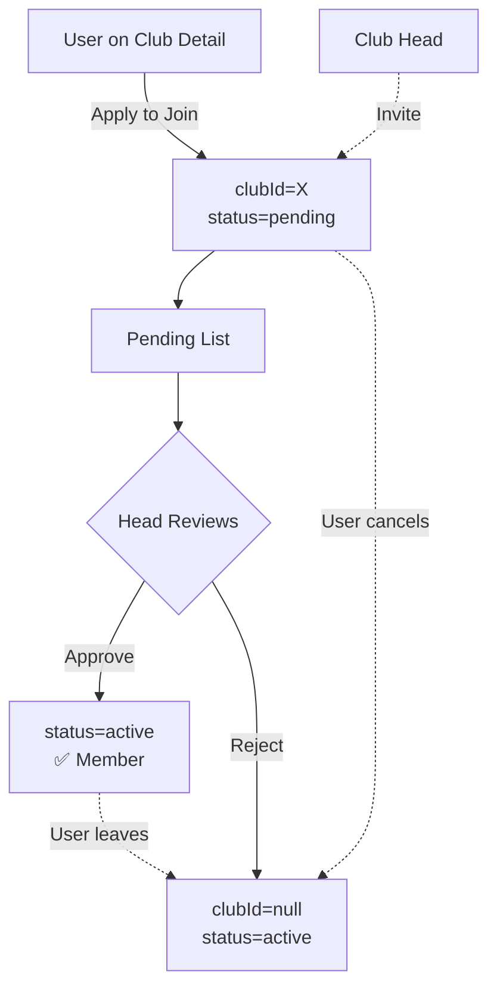
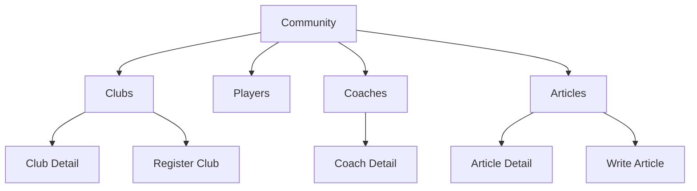
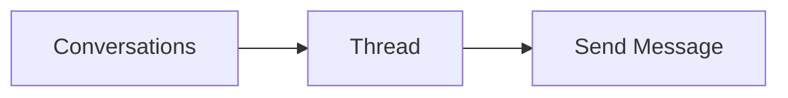
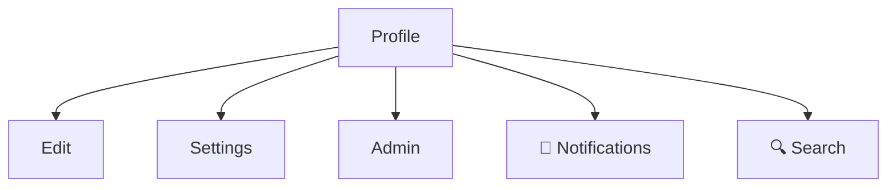
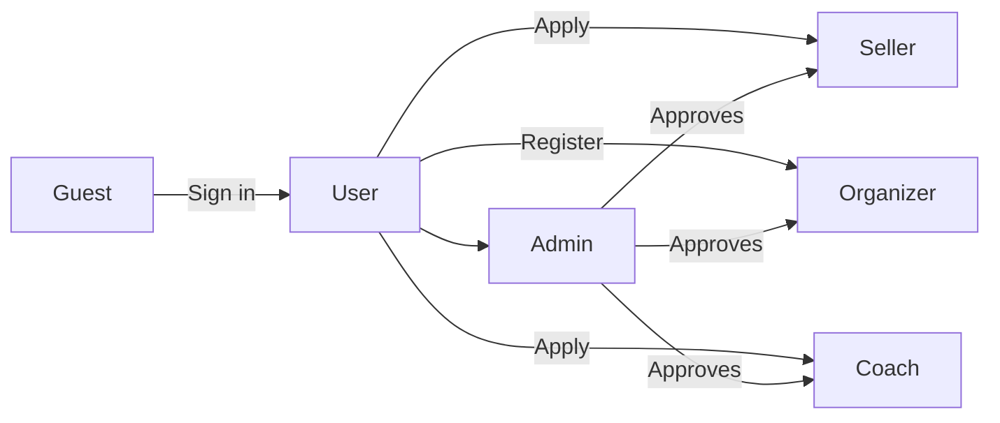

# Chess Hive — App Workflow

## 1. Entry & Auth

## 2. Main Shell (Bottom Nav)

## 3. Tournaments

## 4. Marketplace

## 5. Club Membership

Stored on `users/{uid}` → `clubId` + `status`. Either the user applies or the head invites; only the head/admin can flip `pending → active`.

## 6. Community

## 7. Chat

## 8. Profile

## 9. Roles & Gates

